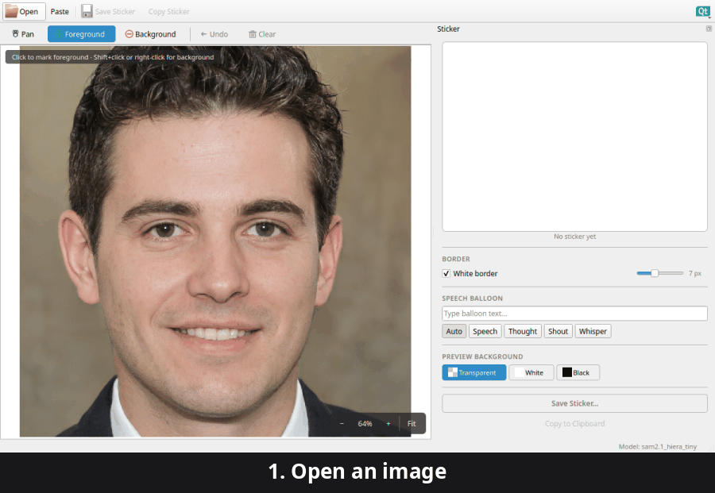

# Sticker Creator

**AI-powered sticker extraction for KDE.** Paste or open an image, click the
subject, and export a transparent 512×512 sticker ready for WhatsApp, Telegram,
or any messenger that accepts PNG stickers.

Segmentation runs entirely on-device using Meta's
[Segment Anything 2 (SAM 2)](https://github.com/facebookresearch/sam2) model —
no image is ever uploaded.



## From photo to sticker

| Before | After |
|--------|-------|
|  |  |

> Sample face from [thispersondoesnotexist.com](https://thispersondoesnotexist.com) — not a real person.

## Features

- Open files, paste from clipboard, or drag-and-drop an image
- One-click subject selection with positive / negative point prompts
- Optional white sticker border
- Output as a 512×512 transparent PNG
- Save to disk or copy straight to the clipboard
- KDE Breeze integration

## Install

### Flatpak (recommended)

```bash
make flatpak-install
```

See [`packaging/flatpak/`](packaging/flatpak/) for the manifest and build script.

### From source

```bash
pip install -e .
python3 models/download_model.py   # fetch the default SAM 2 checkpoint
sticker-creator
```

Or run without installing:

```bash
python3 main.py
```

Requires Python ≥ 3.9, PySide6, torch and sam2 (see [`requirements.txt`](requirements.txt)).

## How it works

1. Load an image (open, paste, or drop).
2. Click points on the subject — positive clicks add, negative clicks subtract.
3. SAM 2 segments the subject on-device.
4. The cutout is trimmed, optionally white-bordered, and resized to 512×512.
5. Save or copy the finished sticker.

## Models

SAM 2 checkpoints live in [`models/`](models/). The default is
`sam2.1_hiera_tiny` (~80 MB); `small`, `base_plus`, and `large` are also
supported. Download with:

```bash
python3 models/download_model.py
python3 models/download_model.py --model sam2.1_hiera_small
```

The app prompts to download a checkpoint automatically if none is present.

## Development

```bash
pytest                       # run tests (use QT_QPA_PLATFORM=offscreen on headless boxes)
pytest tests/test_segmenter.py
```

## License

[GPL-3.0-or-later](LICENSE). Sticker output is yours.
