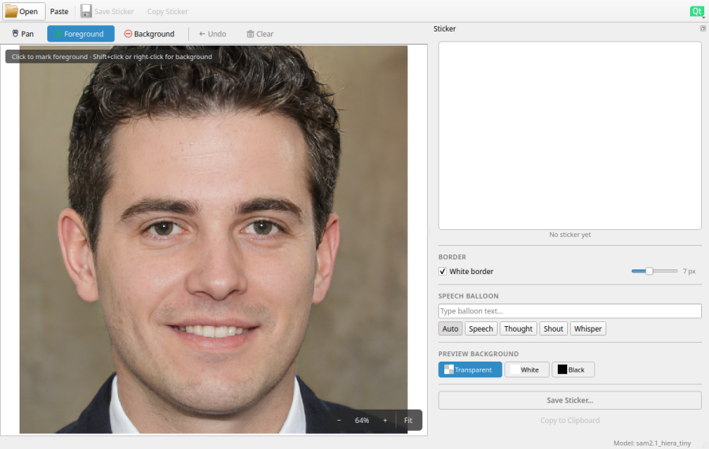
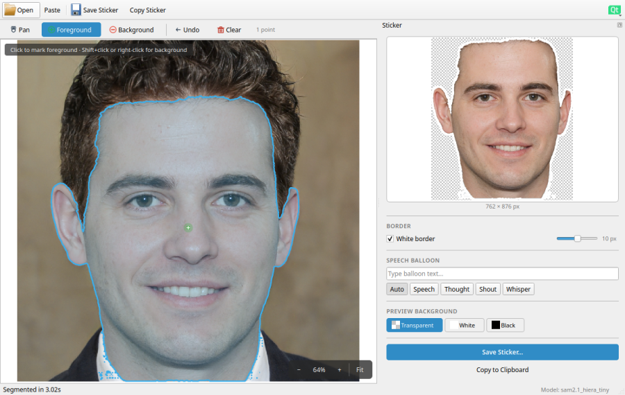
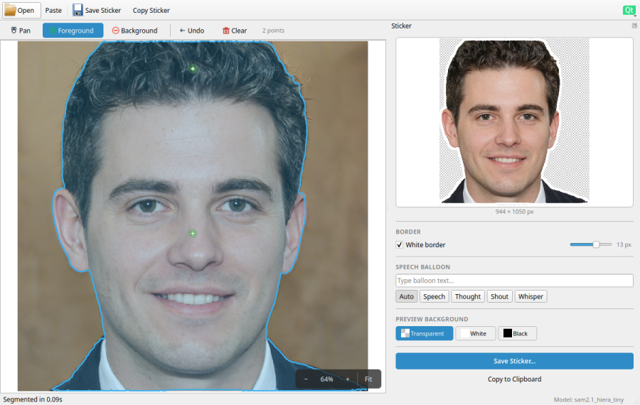
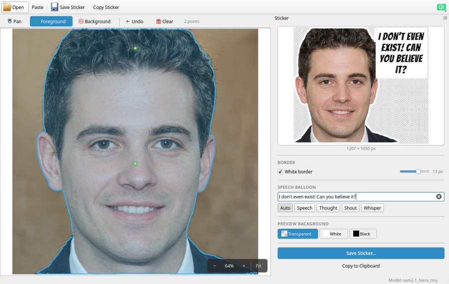

# Sticker Creator — Help

Sticker Creator turns any photo into a transparent, optionally
white-bordered sticker — ready to drop into WhatsApp, Telegram, Signal,
or any other chat app that accepts PNG / WebP stickers.

The whole pipeline runs locally on your machine; no images leave your
computer.

---

## Quick tour

The complete workflow at a glance:

Each step is broken down in detail below.

---

## 1. Open an image

There are three ways to load an image:

| Source        | How                                                |
| ------------- | -------------------------------------------------- |
| File on disk  | **Open Image…** in the toolbar or **`Ctrl+O`**     |
| Clipboard     | **Paste** in the toolbar or **`Ctrl+V`**           |
| Drag & drop   | Drop a PNG / JPEG / WebP / BMP / TIFF onto the app |

The folder of the last opened file is remembered, so the file dialog
re-opens where you left off.

Supported formats: `.png`, `.jpg`, `.jpeg`, `.bmp`, `.webp`, `.tiff`,
`.tif`.

---

## 2. Cut out the subject — segmentation

Click anywhere on the subject you want to keep. The segmentation model
(see [AI model](#ai-model-sam-2) below) infers the full silhouette from
a single click. The sticker preview on the right updates immediately.

If part of the subject is missing (for example, the hair in the picture
above), add more clicks:

| Action               | Effect                                                |
| -------------------- | ----------------------------------------------------- |
| **Left-click**       | Mark a **foreground** point (include this area)       |
| **Shift+click** or **right-click** | Mark a **background** point (exclude this area) |
| **`Ctrl+Z`**         | Undo the last click                                   |
| **`Ctrl+R`**         | Clear all clicks                                      |
| **Mouse wheel**      | Zoom in / out                                         |
| **Drag** (pan mode)  | Pan the image                                         |

You can keep adding clicks until the mask matches the subject exactly.
Each click triggers a fresh inference, so the preview always reflects
the current set of points.

---

## 3. Border and preview background

After the subject is segmented, the right panel exposes three
adjustments:

* **White border** — a sticker-style halo around the silhouette.
  Toggle it on/off; drag the slider to change the thickness (default
  7 px). The border is part of the saved file.
* **Preview background** — Transparent (checkerboard) / White / Black.
  This is only a review aid; the saved sticker stays transparent.

---

## 4. Speech balloon (optional)

Type into the **Speech Balloon** field. After you pause typing (or hit
**Enter** / leave the field), the balloon is rendered into the sticker
and the preview updates.

The balloon shape is picked automatically based on the text, or you can
force one with the style buttons.

| Style       | When **Auto** picks it                                   |
| ----------- | -------------------------------------------------------- |
| **Speech**  | Default — a regular speech bubble.                       |
| **Thought** | Text contains `zzz`, `...`, or 💤 / 💭 / 🌙 / 🫧.        |
| **Shout**   | Text is ALL CAPS, or contains two or more `!`.           |
| **Whisper** | Text is wrapped in `(parentheses)` or `*asterisks*`.     |

The balloon is *merged into the silhouette* before the white border is
applied, so the border wraps subject + balloon as a single sticker.

---

## 5. Save the sticker

**Save Sticker…** (`Ctrl+S`) writes the current preview to disk. The
file dialog defaults to:

* the folder you saved to last;
* a filename of the form
  `{original_stem}_{balloon_slug}_sticker.png` if you typed balloon
  text, otherwise `{original_stem}_sticker.png`.

Format options:

| Filter                                | What it produces                                            |
| ------------------------------------- | ----------------------------------------------------------- |
| **PNG Image**                         | Lossless PNG at full resolution. Best for editing.          |
| **WebP Image**                        | Quality-100 WebP at full resolution. Smaller than PNG.      |
| **WhatsApp Sticker — 512×512 WebP**   | Resized to 512×512, WebP quality 80 — what WhatsApp wants. |

You can also **Copy to Clipboard** (`Ctrl+C`) to paste straight into
another app.

---

## AI model: SAM 2

The segmentation step is powered by **Meta's Segment Anything Model 2
(SAM 2)** running fully on-device with PyTorch.

SAM 2 is prompt-based: it takes the image plus your foreground /
background clicks and predicts a mask. Compared with SAM 1 it produces
more stable masks on small subjects, and per-image embeddings are
cached so additional clicks on the same image are fast.

### Variants

Sticker Creator can use any of the official SAM 2.1 Hiera checkpoints:

| Model                       | Download size | Speed (CPU)        | Mask quality |
| --------------------------- | ------------- | ------------------ | ------------ |
| `sam2.1_hiera_tiny`         | ~148 MB       | Fastest            | Good         |
| `sam2.1_hiera_small`        | ~175 MB       | Fast               | Better       |
| `sam2.1_hiera_base_plus`    | ~308 MB       | Moderate           | Very good    |
| `sam2.1_hiera_large`        | ~856 MB       | Slowest            | Best         |

**Tiny** is the default and is fine for most photos. Step up if you
need crisper edges on fine details (hair, fur, frizzy outlines); step
down if you are on an older / underpowered machine.

Inference runs on the **CPU** in a background thread, so the UI stays
responsive while a mask is being computed.

### Where do the checkpoints live?

Downloaded checkpoints are stored as `models/sam2.1_hiera_*.pt` inside
the application's data directory. They are not bundled with the
application — they are fetched on demand from
`dl.fbaipublicfiles.com`. A tiny placeholder file would not be a valid
checkpoint, so the app checks that every `.pt` is at least ~10 MB
before loading it; corrupt files are automatically re-downloaded.

---

## Model manager

Open it from the hamburger menu → **Manage Models…** or with `Ctrl+M`.

The dialog lets you:

* See which models are **downloaded** vs **available to download**.
* **Download** any of the four variants — progress is shown in the
  dialog and runs in a background thread, so the rest of the app is
  still usable.
* **Switch** the active model: pick one from the list and the
  segmentation thread re-loads it. Embeddings are recomputed on the
  next click. The active model is remembered across launches.
* **Remove** a downloaded checkpoint to free disk space.

If no model is installed yet, the placeholder screen (shown before any
image is loaded) prompts you to download one. The app cannot segment
without an installed model.

---

## Keyboard shortcuts

A complete reference is available under **Help → Keyboard Shortcuts…**
(`Ctrl+/`). The most useful ones:

| Shortcut       | Action                  |
| -------------- | ----------------------- |
| `Ctrl+O`       | Open Image              |
| `Ctrl+V`       | Paste from Clipboard    |
| `Ctrl+S`       | Save Sticker            |
| `Ctrl+C`       | Copy Sticker            |
| `Ctrl+Z`       | Undo Last Click         |
| `Ctrl+R`       | Clear Points            |
| `Ctrl+M`       | Manage Models           |
| `Ctrl+/`       | Keyboard Shortcuts      |
| `Ctrl+Q`       | Quit                    |

---

## Troubleshooting

**“No SAM 2 checkpoint found in models/ directory.”**
You haven't installed a model yet. Open **Manage Models…** and
download one (Tiny is the smallest at ~148 MB).

**Download fails or stops part-way.**
The checkpoint file ends up smaller than ~10 MB and is treated as
corrupt; the next launch will offer to re-download it. You can also
delete it manually from the Model Manager.

**Segmentation is slow.**
SAM 2 runs on CPU. Bigger variants give better masks but cost more
time per click. If you don't need pixel-perfect edges, stay on the
**Tiny** model.

**The mask covers the wrong area.**
Add background points: **Shift+click** or **right-click** inside the
area you want to exclude. The mask refines on every click.

**Saved sticker looks fine but WhatsApp won't accept it.**
Use the **WhatsApp Sticker — 512×512 WebP** filter when saving —
WhatsApp requires that exact size and format.
